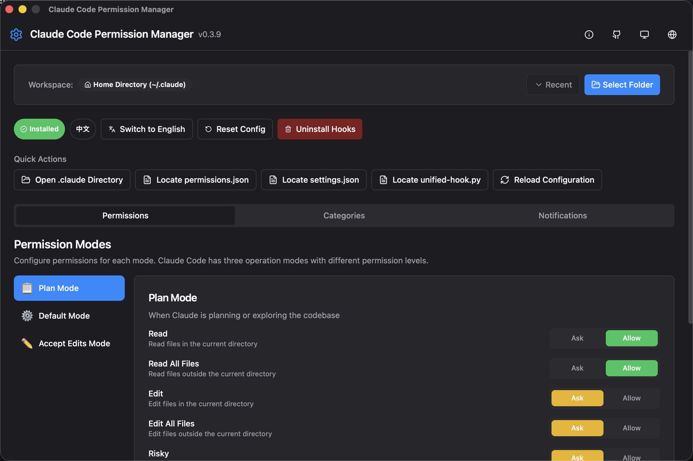
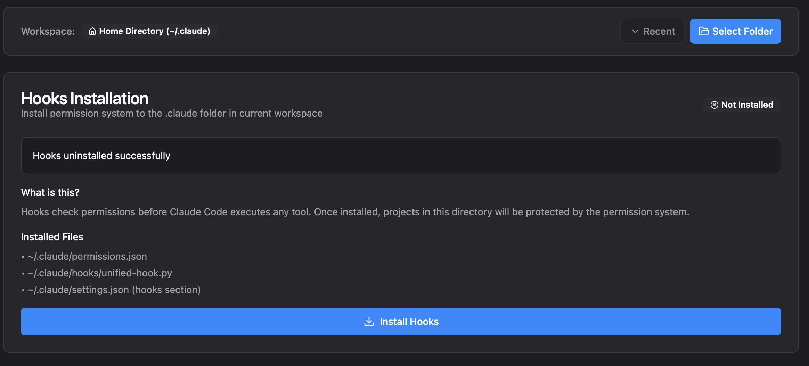
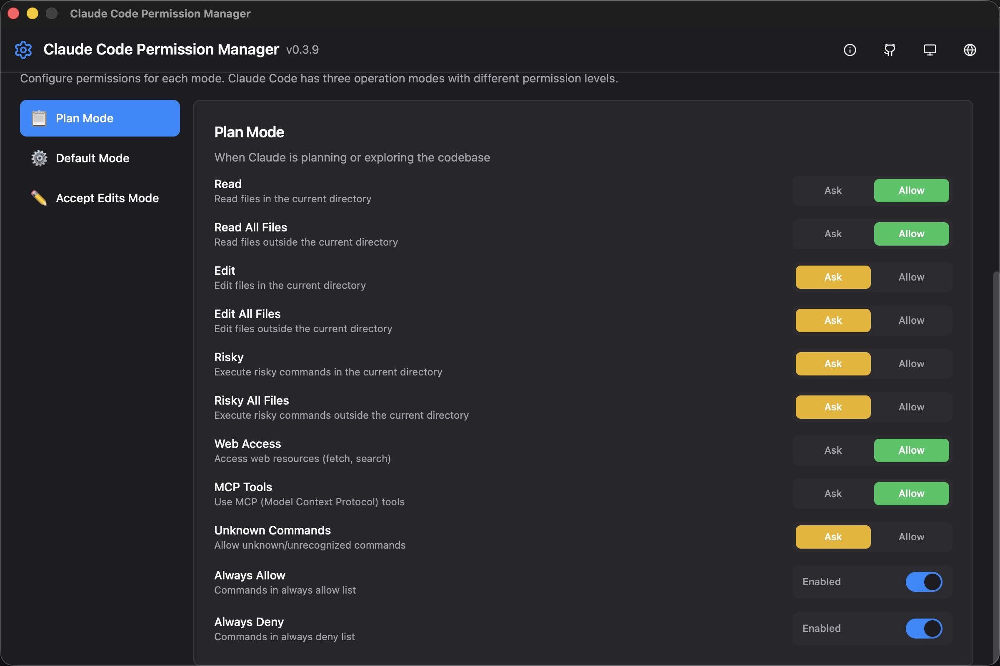
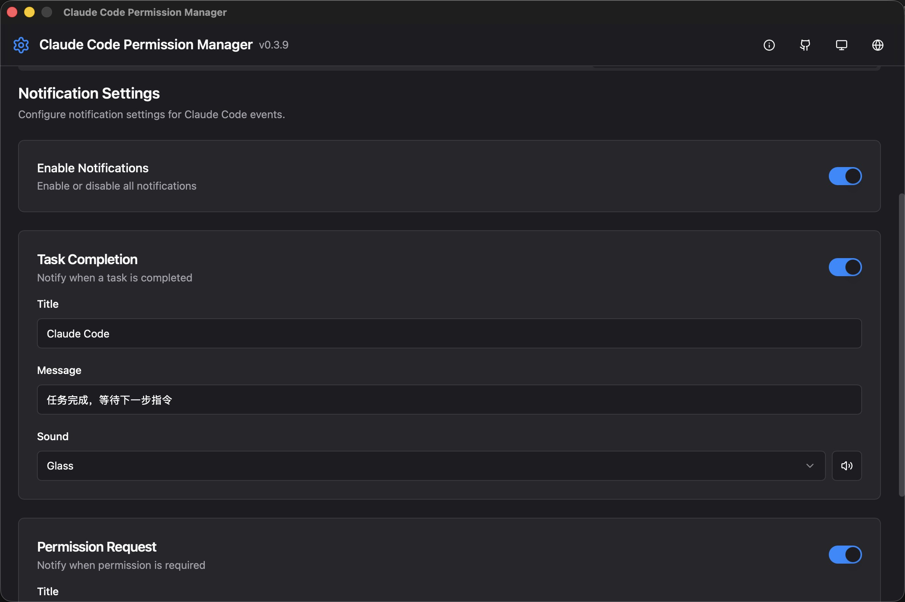
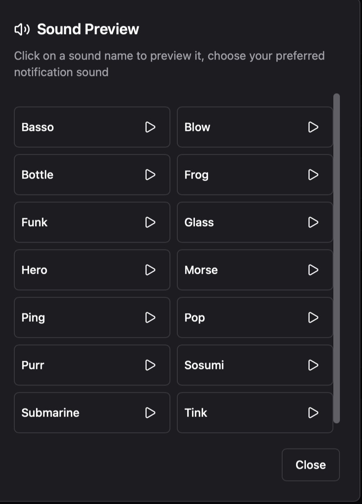
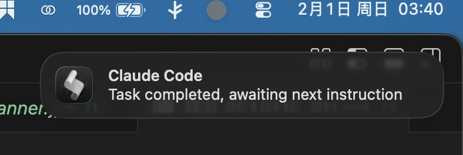

<div align="center">

# Claude Code Permission Manager

A visual tool for managing Claude Code permission configurations

[](https://github.com/Tonyhzk/cc-permission-manager/releases)
[]()
[](https://tauri.app/)
[](https://react.dev/)
[](https://www.typescriptlang.org/)
[](https://vitejs.dev/)
[](https://www.rust-lang.org/)
[](LICENSE)

**English** | [中文](README_CN.md) | [Changelog](CHANGELOG.md)

</div>

---

## Screenshots

### Main Interface



### Install Hook



### Permission Quick Toggle Control



### Command Category Settings


### Alert Settings



### Alert Sound Test



### System Alert



---

## Features

### Core Features

- **Global Permission Configuration** - Manage permissions for different modes
  - Plan Mode
  - Default Mode
  - Accept Edits Mode
- **Category Management** - Configure tool and command category permissions
- **Alert Settings** - Customize alert behavior and sounds
- **Project Settings** - Per-project tool permissions control
- **Multi-language Support** - English and Chinese interface

### Highlights

- Visual permission editing, no more manual JSON modifications
- Real-time configuration preview
- One-click global Hook install/uninstall
- Dark/Light theme support
- Cross-platform support (Windows / macOS)

---

## System Requirements

| Platform | Minimum Version |
|----------|-----------------|
| Windows | Windows 10 (1803+) |
| macOS | macOS 10.15+ |

---

## Download & Installation

### Windows

Download the latest version from [Releases](https://github.com/Tonyhzk/cc-permission-manager/releases):

- **Installer**: `CC-Permission-Manager_x.x.x_x64-setup.exe` (Recommended)
- **MSI Package**: `CC-Permission-Manager_x.x.x_x64_en-US.msi`

### macOS

Download the `.dmg` file from [Releases](https://github.com/Tonyhzk/cc-permission-manager/releases).

> **Note**: If you encounter "unverified developer" warning on first launch, run:
> ```bash
> sudo xattr -rd com.apple.quarantine /Applications/CC\ Permission\ Manager.app
> ```

---

## Quick Start

### 1. Launch the App

Start CC Permission Manager after installation.

### 2. Configure Global Permissions

In the "Global Config" tab:
- Select the mode to configure (Plan Mode / Default Mode / Accept Edits Mode)
- Set permission levels for each tool category
- Click "Save" to apply changes

### 3. Install Global Hook (Optional)

To use the global Hook feature:
- Click "Install Global Hook" button
- Confirm the installation path
- The Hook will automatically apply to all Claude Code sessions

### 4. Project-level Configuration

In the "Project Settings" tab:
- Select or add a project path
- Configure project-specific tool permissions

---

## Configuration Files

The application manages the following configuration files:

| File Path | Description |
|-----------|-------------|
| `~/.claude/permissions.json` | Global permission settings |
| `~/.claude/settings.json` | Global Claude Code settings |
| `<project>/.claude/settings.json` | Project-specific settings |
| `<project>/CLAUDE.md` | Project instructions file |

### Configuration File Locations

- **Windows**: `C:\Users\<username>\.claude\`
- **macOS**: `/Users/<username>/.claude/`

---

## Development Guide

### Prerequisites

- Node.js 18+
- pnpm 8+
- Rust 1.70+ (for Tauri development)

### Install Dependencies

```bash
cd src
pnpm install
```

### Development Commands

```bash
# Start development server
pnpm dev

# Type checking
pnpm typecheck

# Code formatting
pnpm format

# Production build
pnpm build
```

### Rust Backend Development

```bash
cd src-tauri

# Code formatting
cargo fmt

# Linting
cargo clippy

# Run tests
cargo test
```

---

## Tech Stack

| Category | Technology |
|----------|------------|
| Frontend Framework | React 18 |
| Language | TypeScript |
| Styling | Tailwind CSS |
| UI Components | Radix UI |
| State Management | Zustand |
| Internationalization | i18next |
| Build Tool | Vite |
| Animation | Framer Motion |
| Form Validation | React Hook Form + Zod |
| Icons | Lucide React |
| Toast Notifications | Sonner |
| Desktop Framework | Tauri 2.0 |
| Backend Language | Rust |

---

## Project Structure

```
src/
├── components/
│   ├── ui/              # Reusable UI components
│   ├── global-config/   # Global configuration components
│   ├── project/         # Project settings components
│   └── layout/          # Layout components
├── stores/              # Zustand state management
├── types/               # TypeScript type definitions
├── lib/                 # Utility functions and constants
├── locales/             # i18n translation files
└── hooks/               # Custom React hooks

src-tauri/
├── src/                 # Rust backend code
│   ├── main.rs          # Application entry
│   └── commands.rs      # Tauri commands
└── tauri.conf.json      # Tauri configuration
```

---

## Architecture Overview

```
┌─────────────────────────────────────────────────────────┐
│                    CC Permission Manager                 │
├─────────────────────────────────────────────────────────┤
│  ┌─────────────────────────────────────────────────┐   │
│  │                 React Frontend                    │   │
│  │  ┌───────────┐ ┌───────────┐ ┌───────────────┐  │   │
│  │  │  Global   │ │  Project  │ │  Notification │  │   │
│  │  │  Config   │ │  Settings │ │   Settings    │  │   │
│  │  └───────────┘ └───────────┘ └───────────────┘  │   │
│  │                      │                           │   │
│  │              ┌───────┴───────┐                  │   │
│  │              │ Zustand Store │                  │   │
│  │              └───────────────┘                  │   │
│  └─────────────────────────────────────────────────┘   │
│                         │                               │
│                    Tauri IPC                            │
│                         │                               │
│  ┌─────────────────────────────────────────────────┐   │
│  │                 Rust Backend                      │   │
│  │  ┌───────────┐ ┌───────────┐ ┌───────────────┐  │   │
│  │  │   File    │ │  Config   │ │    System     │  │   │
│  │  │   I/O     │ │  Parser   │ │   Commands    │  │   │
│  │  └───────────┘ └───────────┘ └───────────────┘  │   │
│  └─────────────────────────────────────────────────┘   │
│                         │                               │
│              ┌──────────┴──────────┐                   │
│              │  ~/.claude/ configs  │                   │
│              └─────────────────────┘                   │
└─────────────────────────────────────────────────────────┘
```

---

## Contributing

Pull requests are welcome! Before submitting, please ensure:

1. Code passes type checking (`pnpm typecheck`)
2. Code is formatted (`pnpm format`)
3. Commit messages are clear and descriptive

---

## Acknowledgements

This project was inspired by the following excellent projects:

- [CC Switch](https://github.com/farion1231/cc-switch) - All-in-One Assistant for Claude Code, Codex & Gemini CLI
- [Cline](https://github.com/cline/cline) - An excellent AI coding assistant

Thanks to the authors of these projects!

---

## License

[MIT License](LICENSE)

---

## Author

**Tonyhzk**

- GitHub: [@Tonyhzk](https://github.com/Tonyhzk)
- Project: [cc-permission-manager](https://github.com/Tonyhzk/cc-permission-manager)

---

<div align="center">

If this project helps you, please give it a ⭐ Star!

</div>