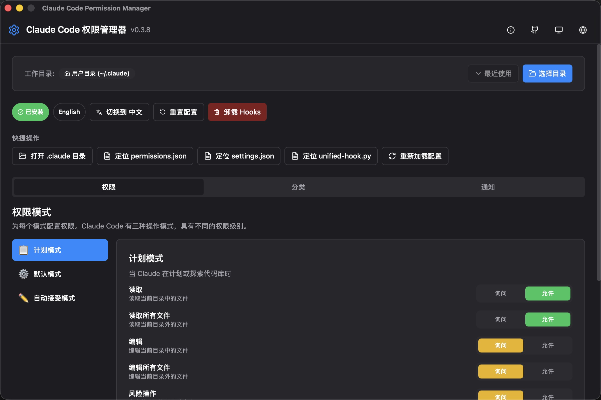
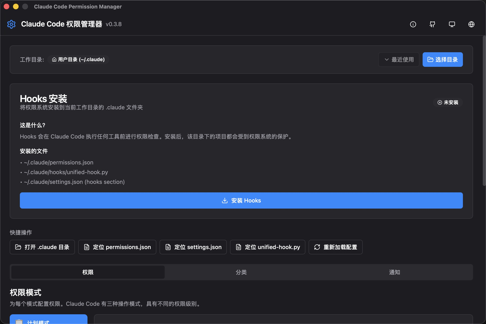
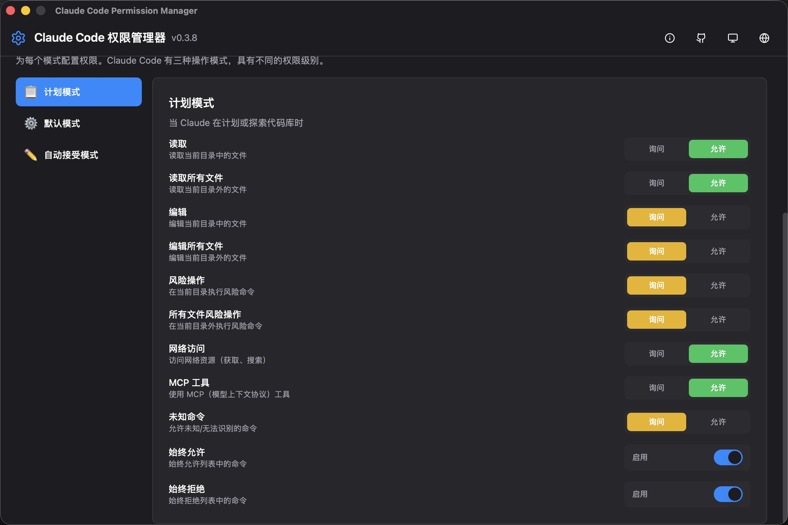
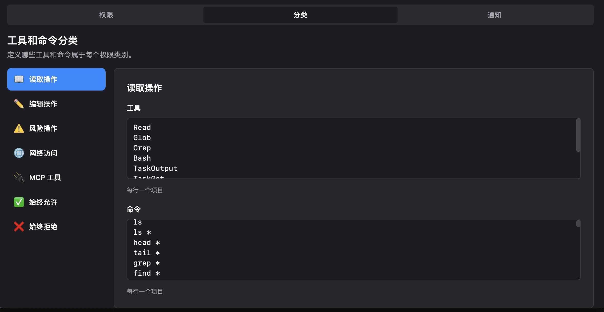
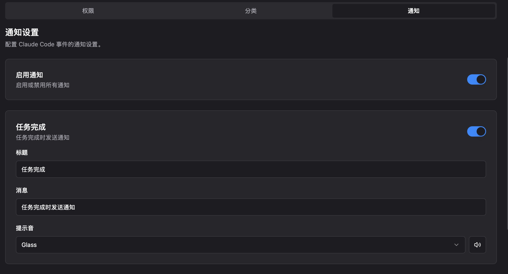
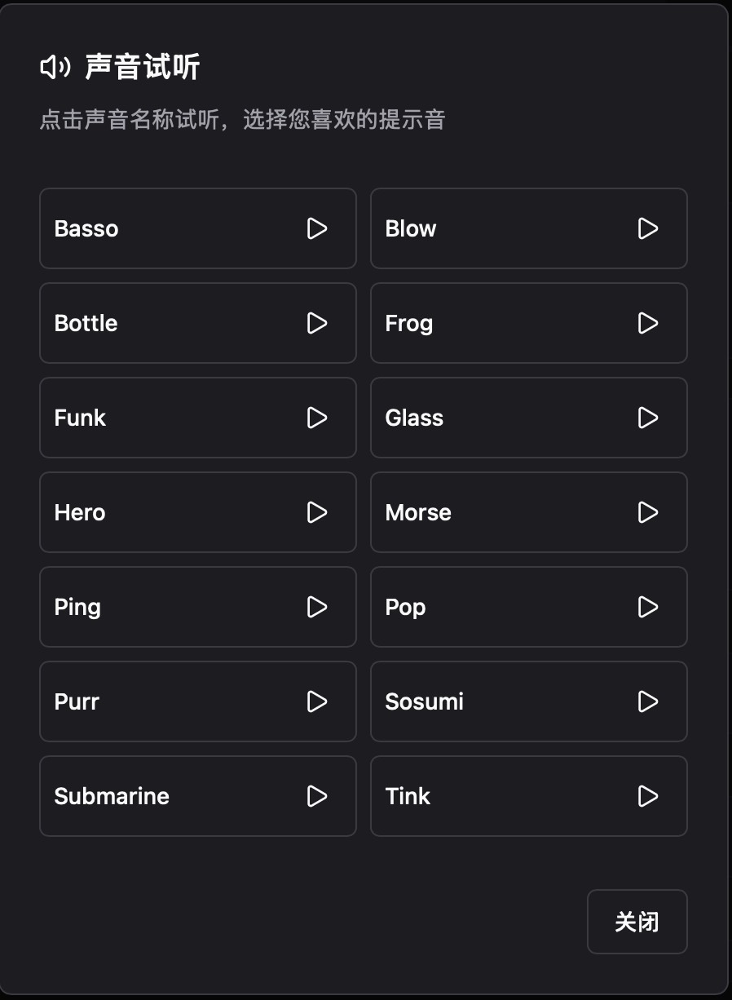
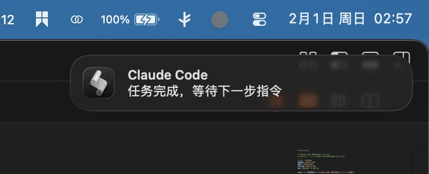

<div align="center">

# Claude Code Permission Manager

一个用于管理 Claude Code 权限配置的可视化工具

[](https://github.com/Tonyhzk/cc-permission-manager/releases)
[]()
[](https://tauri.app/)
[](https://react.dev/)
[](https://www.typescriptlang.org/)
[](https://vitejs.dev/)
[](https://www.rust-lang.org/)
[](LICENSE)

[English](README.md) | **中文** | [更新日志](CHANGELOG.md)

</div>

---

## 界面预览

### 主界面



### 安装Hook



### 权限快速开关控制



### 指令分类设置



### 通知设置



### 通知声音测试



### 系统通知



---

## 功能特性

### 核心功能

- **全局权限配置** - 管理不同模式下的权限设置
  - 计划模式 (Plan Mode)
  - 默认模式 (Default Mode)
  - 接受编辑模式 (Accept Edits Mode)
- **分类管理** - 配置工具和命令的分类权限
- **通知设置** - 自定义通知行为和声音
- **项目设置** - 按项目配置权限
- **多语言支持** - 支持英文和中文界面

### 特色功能

- 可视化权限编辑，告别手动修改 JSON
- 实时预览配置变更
- 一键安装/卸载全局 Hook
- 支持深色/浅色主题
- 跨平台支持 (Windows / macOS)

---

## 系统要求

| 平台 | 最低版本 |
|------|---------|
| Windows | Windows 10 (1803+) |
| macOS | macOS 10.15+ |

---

## 下载安装

### Windows

从 [Releases](https://github.com/Tonyhzk/cc-permission-manager/releases) 页面下载最新版本：

- **安装版**: `CC-Permission-Manager_x.x.x_x64-setup.exe` (推荐)
- **MSI 安装包**: `CC-Permission-Manager_x.x.x_x64_en-US.msi`

### macOS

从 [Releases](https://github.com/Tonyhzk/cc-permission-manager/releases) 页面下载 `.dmg` 文件。

> **注意**: 首次打开时如果遇到"无法验证开发者"的提示，请执行以下命令：
> ```bash
> sudo xattr -rd com.apple.quarantine /Applications/CC\ Permission\ Manager.app
> ```

---

## 快速开始

### 1. 启动应用

安装完成后启动 CC Permission Manager。

### 2. 配置全局权限

在「全局配置」标签页中：
- 选择要配置的模式（计划模式/默认模式/接受编辑模式）
- 为每个工具分类设置权限级别
- 点击「保存」应用更改

### 3. 安装全局 Hook（可选）

如需使用全局 Hook 功能：
- 点击「安装全局 Hook」按钮
- 确认安装路径
- Hook 将自动应用到所有 Claude Code 会话

### 4. 项目级配置

在「项目设置」标签页中：
- 选择或添加项目路径
- 配置项目特定的工具权限

---

## 配置文件

应用程序管理以下配置文件：

| 文件路径 | 说明 |
|---------|------|
| `~/.claude/permissions.json` | 全局权限设置 |
| `~/.claude/settings.json` | 全局 Claude Code 设置 |
| `<项目>/.claude/settings.json` | 项目特定设置 |
| `<项目>/CLAUDE.md` | 项目指令文件 |

### 配置文件位置

- **Windows**: `C:\Users\<用户名>\.claude\`
- **macOS**: `/Users/<用户名>/.claude/`

---

## 开发指南

### 环境要求

- Node.js 18+
- pnpm 8+
- Rust 1.70+ (用于 Tauri 开发)

### 安装依赖

```bash
cd src
pnpm install
```

### 开发命令

```bash
# 启动开发服务器
pnpm dev

# 类型检查
pnpm typecheck

# 代码格式化
pnpm format

# 生产构建
pnpm build
```

### Rust 后端开发

```bash
cd src-tauri

# 代码格式化
cargo fmt

# 代码检查
cargo clippy

# 运行测试
cargo test
```

---

## 技术栈

| 类别 | 技术 |
|-----|------|
| 前端框架 | React 18 |
| 开发语言 | TypeScript |
| 样式方案 | Tailwind CSS |
| UI 组件 | Radix UI |
| 状态管理 | Zustand |
| 国际化 | i18next |
| 构建工具 | Vite |
| 动画 | Framer Motion |
| 表单验证 | React Hook Form + Zod |
| 图标 | Lucide React |
| 通知提示 | Sonner |
| 桌面框架 | Tauri 2.0 |
| 后端语言 | Rust |

---

## 项目结构

```
src/
├── components/
│   ├── ui/              # 可复用 UI 组件
│   ├── global-config/   # 全局配置组件
│   ├── project/         # 项目设置组件
│   └── layout/          # 布局组件
├── stores/              # Zustand 状态管理
├── types/               # TypeScript 类型定义
├── lib/                 # 工具函数和常量
├── locales/             # i18n 翻译文件
└── hooks/               # 自定义 React Hooks

src-tauri/
├── src/                 # Rust 后端代码
│   ├── main.rs          # 应用入口
│   └── commands.rs      # Tauri 命令
└── tauri.conf.json      # Tauri 配置文件
```

---

## 架构总览

```
┌─────────────────────────────────────────────────────────┐
│                    CC Permission Manager                 │
├─────────────────────────────────────────────────────────┤
│  ┌─────────────────────────────────────────────────┐   │
│  │                 React Frontend                    │   │
│  │  ┌───────────┐ ┌───────────┐ ┌───────────────┐  │   │
│  │  │  Global   │ │  Project  │ │  Notification │  │   │
│  │  │  Config   │ │  Settings │ │   Settings    │  │   │
│  │  └───────────┘ └───────────┘ └───────────────┘  │   │
│  │                      │                           │   │
│  │              ┌───────┴───────┐                  │   │
│  │              │ Zustand Store │                  │   │
│  │              └───────────────┘                  │   │
│  └─────────────────────────────────────────────────┘   │
│                         │                               │
│                    Tauri IPC                            │
│                         │                               │
│  ┌─────────────────────────────────────────────────┐   │
│  │                 Rust Backend                      │   │
│  │  ┌───────────┐ ┌───────────┐ ┌───────────────┐  │   │
│  │  │   File    │ │  Config   │ │    System     │  │   │
│  │  │   I/O     │ │  Parser   │ │   Commands    │  │   │
│  │  └───────────┘ └───────────┘ └───────────────┘  │   │
│  └─────────────────────────────────────────────────┘   │
│                         │                               │
│              ┌──────────┴──────────┐                   │
│              │  ~/.claude/ 配置文件  │                   │
│              └─────────────────────┘                   │
└─────────────────────────────────────────────────────────┘
```

---

## 贡献指南

欢迎提交 Pull Request！在提交之前，请确保：

1. 代码通过类型检查 (`pnpm typecheck`)
2. 代码已格式化 (`pnpm format`)
3. 提交信息清晰明了

---

## 致谢

本项目的灵感来源于以下优秀项目：

- [CC Switch](https://github.com/farion1231/cc-switch) - Claude Code 权限切换工具
- [Cline](https://github.com/cline/cline) - 优秀的 AI 编程助手

感谢这些项目的作者们！

---

## 许可证

[MIT License](LICENSE)

---

## 作者

**Tonyhzk**

- GitHub: [@Tonyhzk](https://github.com/Tonyhzk)
- 项目地址: [cc-permission-manager](https://github.com/Tonyhzk/cc-permission-manager)

---

<div align="center">

如果这个项目对你有帮助，欢迎给个 ⭐ Star！

</div>
